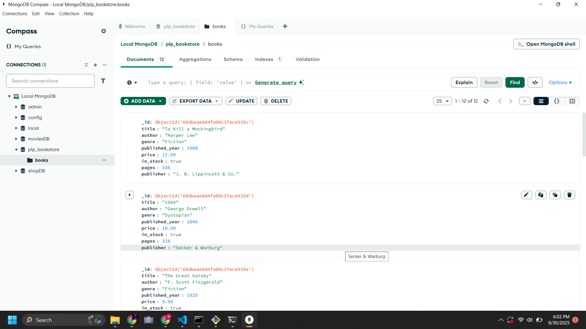

# MongoDB Assignment - Week 1

This repository contains my submission for the MongoDB Data Layer Fundamentals assignment.  
It demonstrates basic database setup, document insertion, queries, and viewing collections in MongoDB Compass.

---

## 📂 Files in this Repository

- **insert_books.js** → Script to populate the database with sample book documents.
- **queries.js** → Script containing queries to retrieve and update documents.
- **screenshot.png** → Screenshot from MongoDB Compass showing the `books` collection.

---

## ⚙️ How to Run the Scripts

1. Ensure MongoDB is installed and running locally on your system.
2. Clone this repository:
   ```bash
   git clone <your-repo-link>
   cd <repo-name>
   Run the insert script to populate the database:
   ```

bash
Copy code
mongo < insert_books.js
Run the queries script:

bash
Copy code
mongo < queries.js
🖥️ MongoDB Compass
Open MongoDB Compass and connect using:

arduino
Copy code
mongodb://localhost:27017
Database: library

Collection: books

Screenshot:

